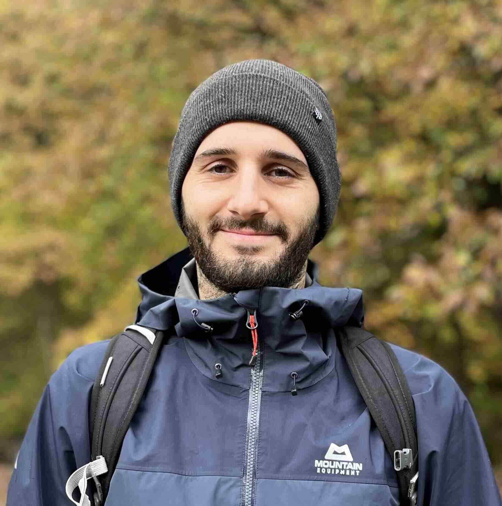

  <picture>
    <source srcset="index/me.avif" type="image/avif">
    <source srcset="index/me.webp" type="image/webp">
    
  </picture>

Hiya! I'm a software engineer based in Cardiff, Wales. I work on 4G and 5G physical layer software
with a focus on portability and performance at [Parallel Wireless](https://www.parallelwireless.com)
in Bristol. I attended a batch at the [Recurse Center](https://www.recurse.com) remotely in
Fall 2025. Along with some friends, I host regular [Zig Days](https://zig.day/) in
[Bristol](https://zig.day/europe/bristol/). You can find my work on
[GitHub](https://github.com/fng97) and you can reach me at
<a href="mailto:hello@francisco.wiki">hello@francisco.wiki</a>. I love surfing, climbing, and
hiking.

I maintain a list of my favourite online resources (talks, articles, blogs, etc.) [here](links.md).

# Posts

<!-- BLOG-POSTS -->
